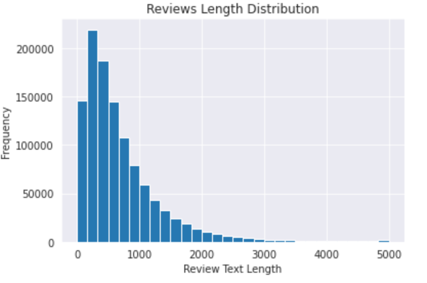
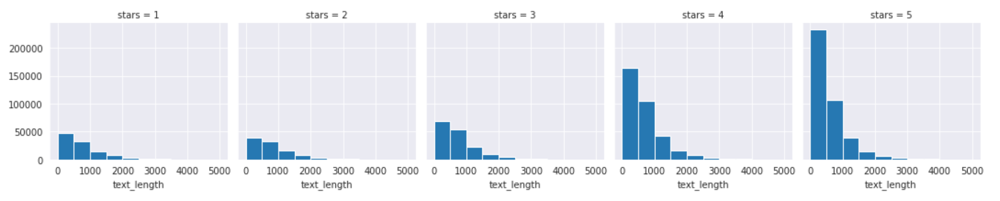
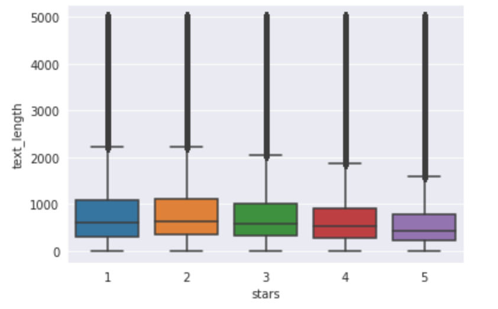
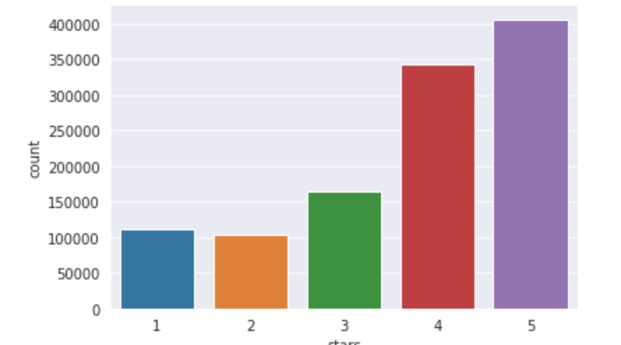
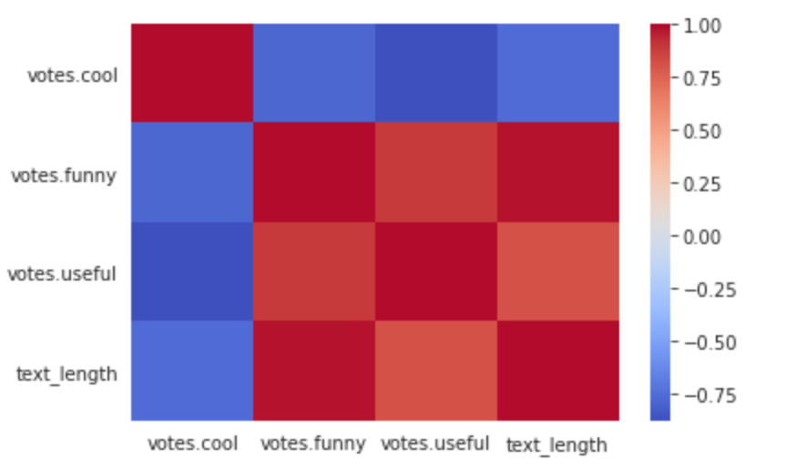
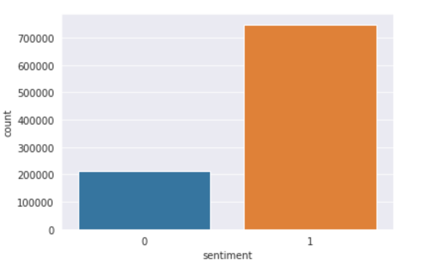
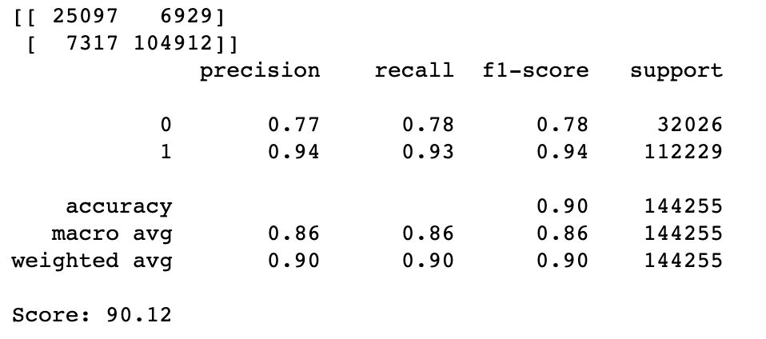
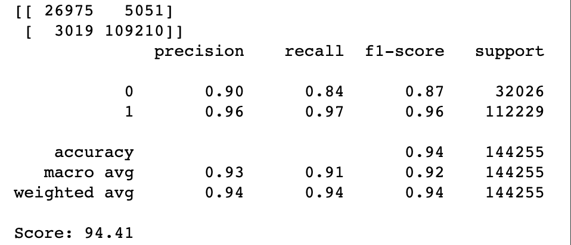

# Yelp_Reviews_Sentiment_Analysis
Performed Sentiment Analysis using different ML models on over 1.1 million reviews to predict if the review is associated with a positive or negative sentiment. Validated the sentiment with the Rating the customer left with the review and the best model, tuned Logistic Regression, achieved an accuracy of 95%. The Naive Bayes model achieved an accuray of 91%.

## Exploratory Data Analysis (EDA)

#### Review Length Distribution

#### Review Length for Different Stars 

#### Boxplot of Review Length for each Star

#### Stars Distribution for Reviews

#### Correlation Heatmap of Different Review Vote Types

#### Count of Reviews of Positive & Negative Senitments

## Model Performance

#### Naive Bayes Model
##### Achieved a maximum accuracy of 90.12%

Confusion Matrix

#### Logistic Regression Model
##### Achieved a maximum accuracy of 94.41%

Confusion Matrix

